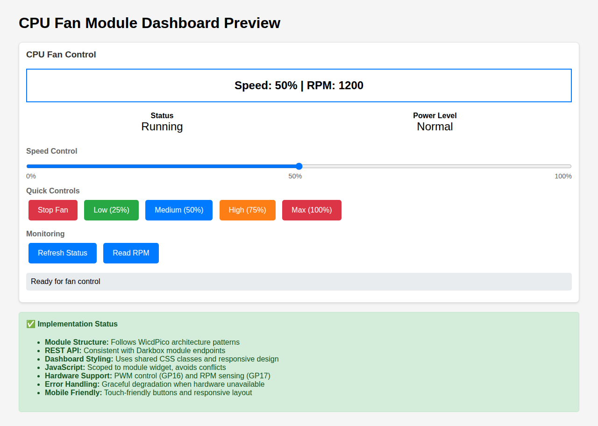
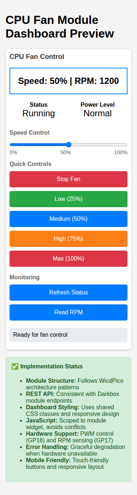

# CPU Fan Module for WicdPico

## Overview

The CPU Fan Module provides comprehensive PWM-based fan speed control and RPM monitoring for the WicdPico system. It follows the established architectural patterns from the Darkbox module and integrates seamlessly with the foundation's dashboard rendering system.

## Features

### Hardware Support
- **PWM Fan Control**: 0-100% variable speed control via GPIO 16
- **RPM Monitoring**: Real-time tachometer reading via GPIO 17
- **Graceful Degradation**: Module works even when hardware is unavailable

### REST API Endpoints
- `GET/POST /cpu-fan-speed` - Get or set fan speed percentage
- `GET /cpu-fan-rpm` - Read current fan RPM
- `GET /cpu-fan-status` - Get comprehensive fan status

### Dashboard Features
- **Interactive Speed Control**: Responsive slider for precise speed adjustment
- **Quick Control Buttons**: Stop, Low (25%), Medium (50%), High (75%), Max (100%)
- **Real-time Monitoring**: Live RPM display with refresh capability
- **Status Indicators**: Visual feedback for fan state and power level
- **Mobile Responsive**: Touch-friendly interface optimized for all screen sizes

## Hardware Setup

### Connections
```
Pico 2 W Pin   | Connection        | Purpose
---------------|-------------------|------------------
GPIO 16        | PWM Fan Control   | Speed control output
GPIO 17        | Tachometer Input  | RPM sensing input  
GND            | Fan Ground        | Common ground
3.3V or 5V     | Fan Power         | Fan power supply
```

### Fan Requirements
- **PWM Compatible**: 3-pin or 4-pin PC fan with PWM control
- **Tachometer**: 4-pin fan with tachometer signal for RPM feedback
- **Voltage**: 5V or 12V (external power supply recommended for 12V fans)

## Installation

### Basic Integration
```python
from foundation_core import WicdpicoFoundation
from module_cpu_fan import CPUFanModule

foundation = WicdpicoFoundation()
cpu_fan = CPUFanModule(foundation)
foundation.register_module("cpu_fan", cpu_fan)
```

### With Existing Modules
```python
# Enhanced Darkbox system with CPU fan control
from module_darkbox import DarkBoxModule
from module_cpu_fan import CPUFanModule

foundation = WicdpicoFoundation()

# Register all modules
darkbox = DarkBoxModule(foundation)
cpu_fan = CPUFanModule(foundation)

foundation.register_module("darkbox", darkbox)
foundation.register_module("cpu_fan", cpu_fan)
```

## Usage Examples

### Standalone Testing
Use the provided test template:
```bash
# Copy code_cpu_fan.py to your Pico 2 W as code.py
# Access dashboard at http://192.168.4.1
```

### Integration Testing  
Use the enhanced integration:
```bash
# Copy code_darkbox_with_fan.py to your Pico 2 W as code.py
# Access combined dashboard with fan control
```

### API Usage
```python
# Set fan speed to 75%
response = requests.post('http://192.168.4.1/cpu-fan-speed', 
                        json={'speed': 75})

# Get current RPM
response = requests.get('http://192.168.4.1/cpu-fan-rpm')
rpm_data = response.json()
print(f"Current RPM: {rpm_data['rpm']}")

# Get full status
response = requests.get('http://192.168.4.1/cpu-fan-status')
status = response.json()
print(f"Speed: {status['speed_percent']}%, RPM: {status['rpm']}")
```

## Dashboard Interface

The CPU Fan module provides a complete dashboard widget with:

### Speed Control Section
- **Main Display**: Large, prominent speed and RPM indicators
- **Slider Control**: Smooth 0-100% speed adjustment
- **Quick Buttons**: Instant access to common speed settings

### Monitoring Section  
- **Status Display**: Current fan state (Running/Stopped)
- **Power Level**: Visual indicator for Normal/High power usage
- **Refresh Controls**: Manual status and RPM updates

### Visual Consistency
- **Shared Styling**: Uses foundation CSS classes for consistency
- **Color Coding**: Status-appropriate color schemes
- **Responsive Design**: Optimized for desktop and mobile devices

## Screenshots

### Desktop Interface

*Full desktop view showing all controls and status indicators*

### Mobile Interface  

*Mobile-optimized layout with touch-friendly controls*

### Interactive Demo

*Demonstration of speed control and status updates*

## Architecture

### Module Structure
```
CPUFanModule(WicdpicoModule)
├── Hardware Interface
│   ├── PWM Output (GPIO 16)
│   └── Tachometer Input (GPIO 17)
├── REST API Routes
│   ├── /cpu-fan-speed (GET/POST)
│   ├── /cpu-fan-rpm (GET)  
│   └── /cpu-fan-status (GET)
├── Dashboard Widget
│   ├── Speed Control Interface
│   ├── RPM Monitoring Display
│   └── Status Indicators
└── Update Loop Integration
    └── RPM Measurement
```

### Design Patterns
- **Module Base Inheritance**: Follows WicdpicoModule patterns
- **Route Registration**: Consistent with existing modules
- **Dashboard Integration**: Uses foundation.render_dashboard()
- **Error Handling**: Graceful degradation for hardware issues
- **JavaScript Scoping**: Module-specific functions avoid conflicts

## Error Handling

The module provides robust error handling:

### Hardware Unavailable
- Module initializes with `fan_available = False`
- Dashboard shows "Unavailable" status
- API endpoints return appropriate error messages

### PWM Failure
- Speed control operations return error status
- Dashboard displays error feedback
- Fan state remains in last known good configuration

### Tachometer Issues
- RPM readings return 0 when tachometer unavailable
- Measurement continues attempting to recover
- No impact on speed control functionality

## Testing

### Integration Test
```bash
python3 test_cpu_fan_integration.py
```

### Mock Environment
The module includes comprehensive testing with mocked hardware for development and CI/CD environments.

### Hardware Testing
1. Deploy `code_cpu_fan.py` to Pico 2 W
2. Connect PWM fan to GPIO 16
3. Connect tachometer to GPIO 17  
4. Access dashboard at http://192.168.4.1
5. Test all speed settings and RPM monitoring

## Contributing

When extending the CPU Fan module:

1. **Follow Patterns**: Maintain consistency with existing WicdPico modules
2. **Test Thoroughly**: Include both mock and hardware testing
3. **Document Changes**: Update this README and inline documentation
4. **Mobile First**: Ensure all UI changes work on mobile devices
5. **Error Handling**: Provide graceful degradation for hardware issues

## License

SPDX-FileCopyrightText: 2025
SPDX-License-Identifier: MIT